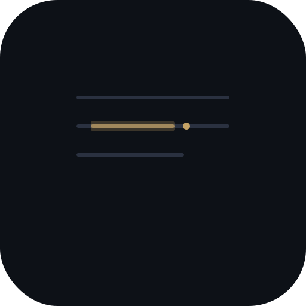

<p align="center">
  
</p>

<h3 align="center">Quali</h3>

<p align="center">
  Qualitative coding for academic researchers.<br />
  Runs entirely in your browser. No server. No account. No tracking.
</p>

<p align="center">
  <strong><a href="https://quali.ogio.dev">Open Quali →</a></strong>
</p>

---

### Getting started

1. Open **[quali.ogio.dev](https://quali.ogio.dev)** in Chrome, Safari, Firefox, or Edge
2. Create a project
3. Drop your interview transcripts (.txt, .md, or .docx)
4. Select text, assign codes

Nothing to install. Works offline after first visit.

---

### Why Quali

Existing tools cost $1,500/year, require IT approval to install, and upload your participants' words to someone else's server.

Quali is different:

- **Open the URL, start coding.** No download, no account, no license key.
- **Your data stays on your device.** Everything is stored in your browser. Zero network requests — verify it yourself in DevTools.
- **Free forever.** No ads, no premium tier, no feature gates. Open source (MIT).
- **Take your work anywhere.** Export to CSV, JSON backup, or REFI-QDA (.qdpx) for NVivo / ATLAS.ti / MAXQDA.

Suitable for sensitive research data — no data processing agreement (DPA) required.

---

### Features

**Coding**

- Select text → assign a code with one click, keyboard shortcut (1–9), or ⌘K palette
- Visual highlighting that preserves Arabic, CJK, Devanagari, and Thai scripts
- Code Retrieval — click a code to see every segment across all documents, click to jump to context
- Undo with ⌘Z

**Organization**

- Analytic memos — project-level and linked to individual codes
- Code merge — combine two codes without losing segments
- Dark and light themes
- Works offline (PWA)

**Export**

- CSV — segments with codes and document names
- JSON — full project backup with round-trip restore
- REFI-QDA .qdpx — interoperable with NVivo, ATLAS.ti, MAXQDA

---

### Privacy & Security

All data stays in your browser's local storage. Quali is a static site with no server component. The application makes zero external network requests.

See [SECURITY.md](SECURITY.md) for the full security policy.

---

### License

MIT — Tomohito Oginome

---

<details>
<summary><strong>For developers</strong></summary>

#### Tech stack

Svelte 5 · Vite · Dexie.js (IndexedDB) · TypeScript

#### Development

```
npm install
npm run dev
```

#### Build

```
npm run build
```

Static output in `build/`, deployable to any hosting.

See [CONTRIBUTING.md](CONTRIBUTING.md) for contribution guidelines.

</details>
